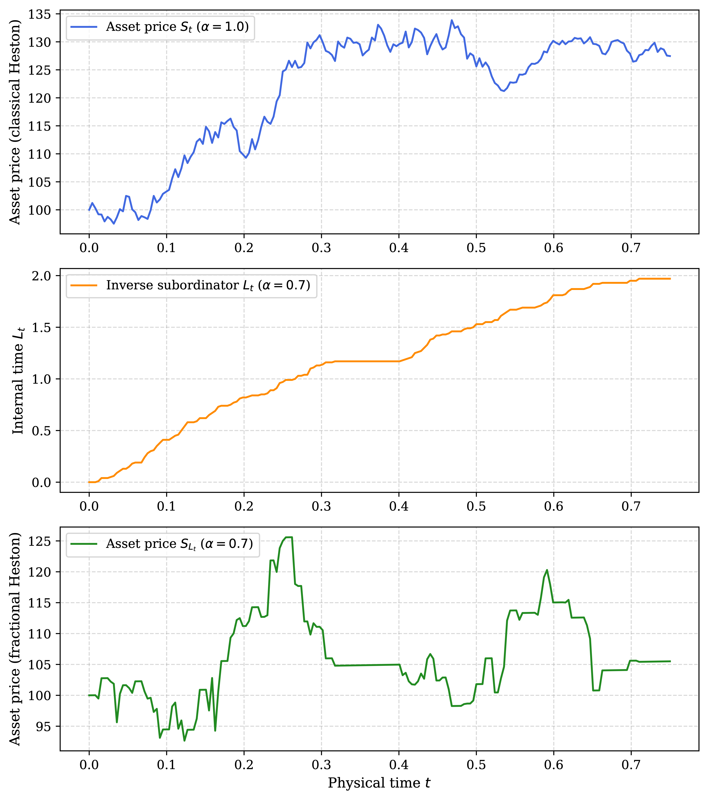
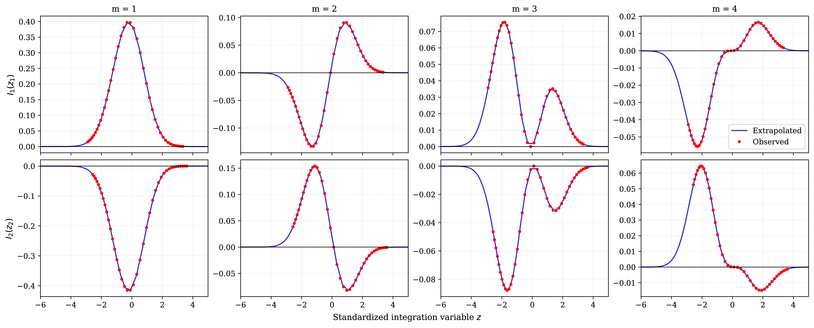
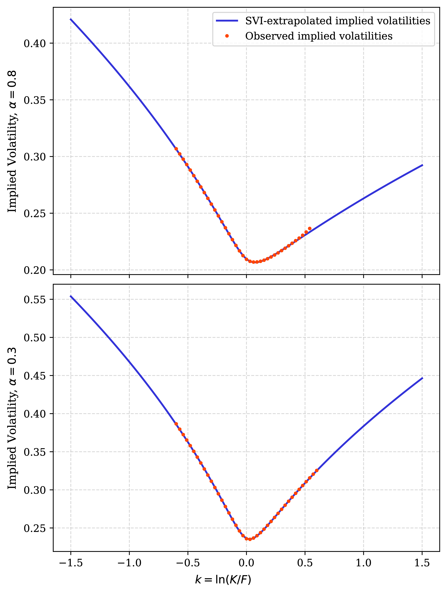
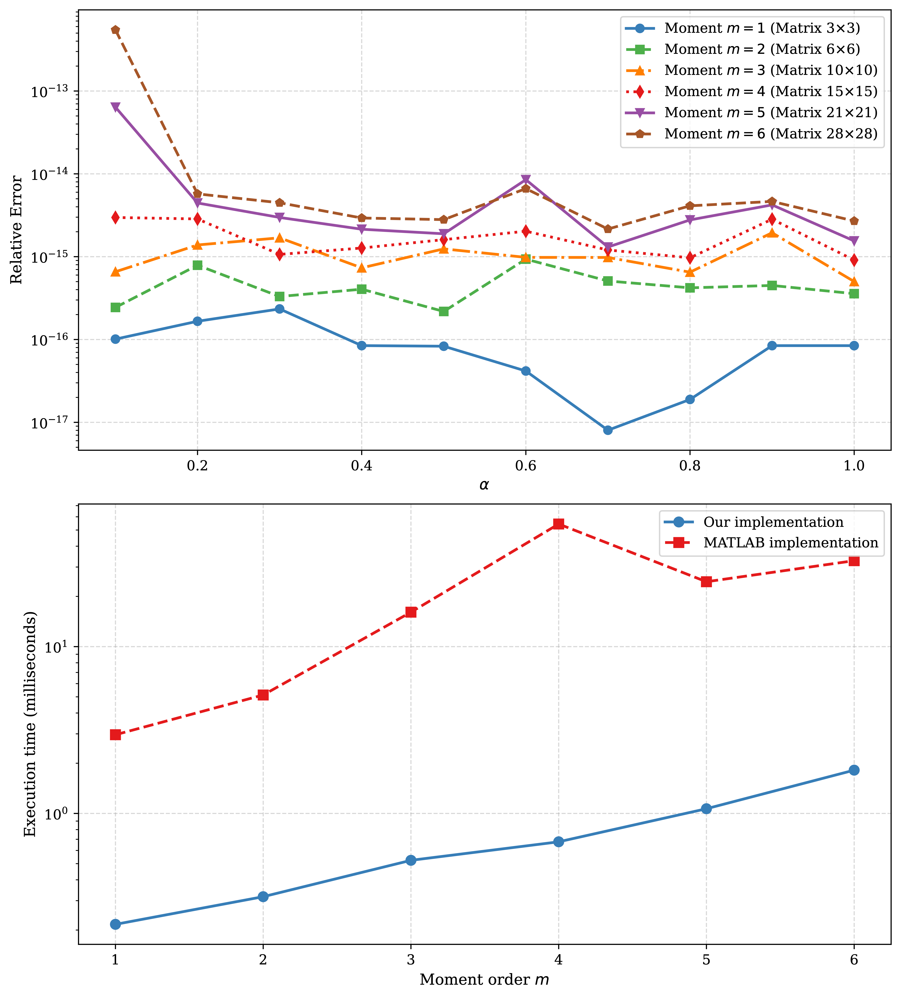
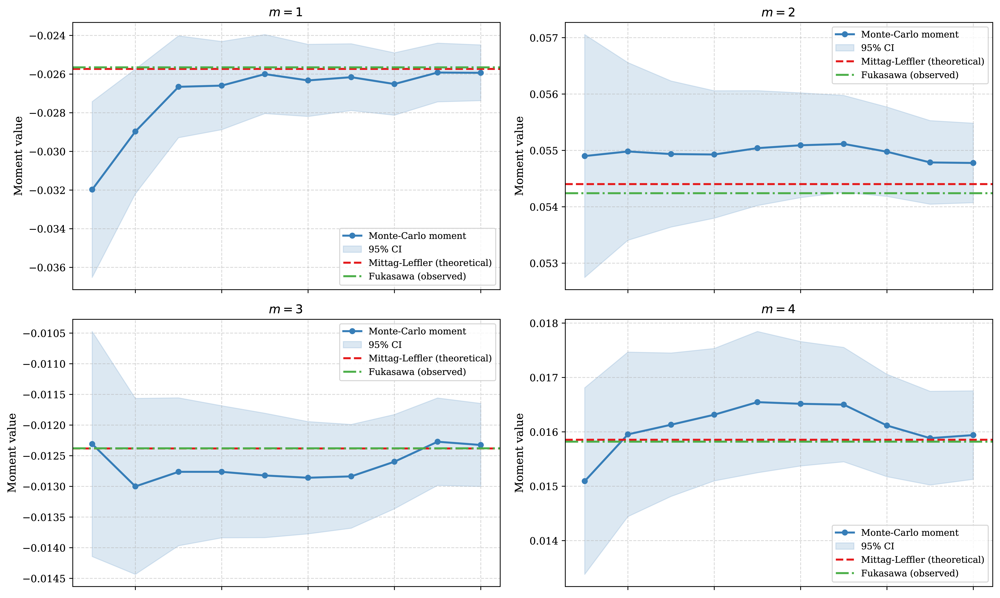

# Calibration of fractional polynomial models based on volatility-implied moments

## Overview

This repository contains the Python implementation for the Master's Thesis **"Calibration of fractional polynomial models based on volatility-implied moments"**.

The project extends the computationally efficient **implicit moments calibration method** [6] from classical Markovian polynomial processes to **non-Markovian fractional polynomial processes**, specifically focusing on the **fractional Heston model**. The research question can be formulated as follows:

> *Can the parameters of a fractional polynomial model be efficiently calibrated using the implicit moments method? In particular, is it possible to recover the long-range dependence parameter α directly from volatility smiles?*

As a result, we developed a fast calibration pipeline that successfully isolates and recovers the long-range dependence parameter $\alpha$ with high accuracy ($|\alpha_\Delta| < 6.5\\%$ for all the experiments). 

## Methodology & pipeline

On the one hand, the Fukasawa formula allows us to extract all moments of the logarithmic price process directly from implied volatility curves. On the other hand, for the class of fractional polynomial processes, these same moments can be quickly computed analytically using the matrix Mittag-Leffler function for the extended generator matrix. Since the second method depends directly on the model parameters, we need to optimize them so that the theoretical moments match the model-free market moments obtained via Fukasawa.

```
┌─────────────────────────────────────────┐                               ┌──────────────────────────────────────┐
│              Market data                │                               │       Fractional Heston model        │
│         Implied volatility smiles       │                               |    Parameters: κ, θ, η, ρ, v0, α     |
└────────────────────┬────────────────────┘                               └──────────────────┬───────────────────┘
                     │                                                                       │
                     ▼                                                                       ▼
┌─────────────────────────────────────────┐                              ┌─────────────────────────────────────────┐
│            Fukasawa formula             │                              │           Extended generator            │
│          Numerical integration          │                              │        Mittag-Leffler function          │
└────────────────────┬────────────────────┘                              └───────────────────┬─────────────────────┘
                     │                                                                       │
                     ▼                                                                       ▼
┌─────────────────────────────────────────┐                             ┌───────────────────────────────────────────┐
│        Empirical market moments         │                             │            Theoretical moments            │
│           E_F[(ln(S_T/F))^m]            │                             │            E_ML[(ln(S_T/F))^m]            │
└────────────────────┬────────────────────┘                             └────────────────────┬──────────────────────┘
                     │                                                                       │
                     │                                                                       │
                     └──────────────────────────┐               ┌────────────────────────────┘
                                                │               │
                                                ▼               ▼
                                   ┌──────────────────────────────────────────┐
                                   │          Parameter optimization          │
                                   |      Minimize relative moment error      |
                                   └──────────────────────────────────────────┘                                     
```

Below, we briefly outline the necessary theory for a better understanding.

### Fractional polynomial processes
A **polynomial process** $X_t$ is a Markov process with extended generator $\mathbb{G}$, such that $\forall k \geq 0: \mathbb{G}(\mathcal{P}_k) \subseteq \mathcal{P}_k$, i.e., its generator maps polynomials to polynomials of the same or lower degree.

**Inverse $\alpha$-stable subordinator** $L_t$ is the hitting time process: $$L_t = \inf \\{ s > 0 : \sigma_s > t \\}, \quad t \geq 0,$$
where $\sigma_s$ is an $\alpha$-stable Lévy subordinator with $\alpha \in (0, 1)$. This is a non-decreasing process interpreted as a stochastic time change. The smaller $\alpha$ is, the longer and more frequent horizontal, flat segments become.

A **fractional polynomial process** $Y_t = X_{L_t}$ is constructed by time-changing a classical polynomial process $X_t$ with an independent inverse $\alpha$-stable subordinator $L_t$. This process loses the Markov property, and its autocorrelation decays much slower, following a power law with exponent $\alpha$, which creates the long memory effect.



### Model-free market moments (Fukasawa formula)
Empirical moments of the log-price process are extracted directly from observable implied volatility smiles without assuming a specific underlying model:

> **Theorem 1** (*Fukasawa moment formula* [1]).  
> Let $\Psi$ be an absolutely continuous function with derivative $\Psi'$ of polynomial growth. Let $g_1$ and $g_2$ be the inverse functions of normalizing transformations $f_1$ and $f_2$. If there exists $q > 0$ such that $\mathbb{E}[S_T^{-q}] < \infty$, then:
>
> $$\mathbb{E}\left[\Psi \left(\log\frac{S_T}{F}\right)\right] = \int_{-\infty}^{\infty} \left\\{ \Psi(g_2(z)) - \Psi'(g_2(z)) + \Psi'(g_1(z))e^{-g_1(z)} \right\\} \varphi(z) dz.$$

### Theoretical moments (matrix Mittag-Leffler function)
We must be able to compute the exact same moments for our specific model. In the classical Markov case, conditional moments of a polynomial process $X_t$ are easily computed using a matrix exponential. However, as we mentioned, replacing time with the inverse $\alpha$-stable subordinator $L_t$ means the Markov property is lost. Nevertheless, the structure is preserved in a very elegant way. For fractional polynomial processes, the matrix exponential is simply replaced by the matrix Mittag-Leffler function. Theoretical moments for fractional polynomial processes are computed in closed form:

> **Theorem 2** (*Mittag-Leffler moment formula* [2]).  
> Let $S$ be a closed subset of $\mathbb{R}^d$, and $L_t$ be the inverse $\alpha$-stable subordinator with $\alpha \in (0,1)$. Let $X_t$ be $m$-polynomial process with generator $\mathcal{G}$, and let $A \in \mathbb{R}^{N \times N}$ be the matrix representation of $\mathcal{G}$ in a basis $H(x)$ of $\mathcal{P}_m$, then
>
> $$\forall p \in \mathcal{P}_m, x \in S \qquad \mathbb{E}_x \left[ p(X_{L_t}) \right] = H(x)^T E_{\alpha}(t^{\alpha}A) \vec{p}, t > 0.$$
> 
> where
>
> $$E_\alpha(z) = \sum_{k = 0}^\infty \frac{z^k}{\Gamma(\alpha k + 1)}, z \in \mathbb{C}$$
>
> and $\vec{p}$ is the coordinate representation of the polynomial $p$ in the basis $H(x)$.

### Calibration
By combining the previous two results, we can formalize the calibration problem. Our goal is to find a parameter set $\Theta$ that minimizes the error between market data and theory. Let $L_{t,m}$ be the empirical moments obtained by integrating the Fukasawa formula and $R_{t,m}$ be the theoretical moments computed via the Mittag-Leffler function, which depends on the parameters. We minimize the sum of squared relative errors across different expiration times $T$ and moment orders $m$, using also weights $w$ for balancing the integration error and keeping the calibration algorithm stable:

$$\min_{\Theta} \sum_{t \in \{T_1, ..., T_n\}} \sum_{m = 1}^M w_{t,m} \left( \frac{\mathcal{L}_{t,m} - \mathcal{R}_{t,m}(\Theta)}{\mathcal{L}_{t,m}} \right)^2$$

## Implementation
All python scripts can be found here: [Implementation](Implementation/).

### Synthetic volatility smiles
First of all, for the controlled experiment, we need to be able to construct volatility smiles for defined fractional Heston models. In [Implementation/DataGeneration](Implementation/DataGeneration/) we generate volatility smiles using Monte-Carlo simulations, where for generating the paths we use our implementation of fractional Heston model from [Implementation/HestonModel](Implementation/HestonModel/). 

For tests we chose three base parameter sets for the fractional Heston model: standard market, high leverage market, and a parameter set violating the Feller condition. For each set, we ran 8 experiments, varying the $\alpha$ parameter from 0.3 to 1.0. In total, this gave us 24 test scenarios for different expiration times. Below are examples of the generated smiles for a 9-month expiration. It is clearly visible how the parameter $\alpha$ transforms the shape of the implied volatility curve, it becomes much more convex.


Volatility smiles for all 24 tests and expiration times can be found here: [SimulatedData](SimulatedData/).

### Fukasawa: SVI-extrapolation and numerical integration
The Fukasawa formula requires computing an integral over an infinite interval. However, in practice, the available market option strikes are strictly bounded. This graph shows the integrands for moments of order 1-4. The red dots represent values we can obtain directly from observable market data. As you can see, they only cover the central part, and the integrand does not converge to zero within this range. 



The solution to this problem is extrapolating the implied volatility smile beyond observable strikes using the Stochastic Volatility Inspired (SVI) parameterization:

$$w(x) = a + b(\rho(x-m) + \sqrt{(x-m)^2 + \sigma^2})$$, where $w(x) := \sigma_{IV}(x)^2 T$.

To make calibration efficient, we split the parameters into non-linear and linear groups. To optimize the non-linear part, we use the Nelder-Mead method with probabilistic restarts. This reduces the chance of getting stuck in a local minimum. The linear part is solved analytically as a simple $3 \times 3$ system
of linear equations. Then, to avoid arbitrage, we check Durrleman's condition. If violated, the model switches to Jump-Wing parameterization for arbitrage elimination. Below is the result of our extrapolation. For a more precise description of this method you can read [3], [4] and find the implementation in [Implementation/MomentsCalculation](Implementation/MomentsCalculation/).



Finally, having a continuous and arbitrage-free curve across the entire real line, we can complete the
Fukasawa moment computation. For numerical integration, we use cubic spline interpolation. The main advantage of this approach is that on each individual segment, our spline is a cubic polynomial. When multiplied by the standard normal density, the integral of this polynomial is computed strictly analytically using Gaussian moments. Moreover, the integration is performed with dynamically expanding bounds until the integrand values at the edges become small enough. This ensures high accuracy for our algorithm.

### Mittag-Leffler: matrix function computation
In the formula from Theorem 2, all terms are straightforward to compute except for the matrix ML-function. First, we decompose the matrix into a unitary and an upper triangular matrix using the Schur decomposition. This allows us to shift to computing the target function from the upper triangular
matrix $Z$. The values on the diagonal blocks of matrix $Z$ are computed using the scalar Mittag-Leffler function and its derivatives at the eigenvalue points, using Djrbashian-type summation formulas. Then, to compute the off-diagonal blocks, we apply the Parlett recurrence method. For more details, see [5], where the authors implemented a more general algorithm in MATLAB. But here, we did our own implementation in Python [Implementation/MomentsCalculation](Implementation/MomentsCalculation/), combining their ideas and our special case of fractional Heston model.

The charts show a comparison of our implementation against the benchmark MATLAB algorithm by the authors. As you can see in the bottom graph, our execution time is around one millisecond, whereas their universal approach takes hundreds of milliseconds. At the same time, the top graph demonstrates that the relative error of our matrix function remains at machine precision.



### Moment comparison: Mittag-Leffler vs. Fukasawa vs. Monte-Carlo
Before running the calibrator, we must ensure all algorithm components work harmoniously. This chart compares moments obtained in three different ways: analytically via the Mittag-Leffler function, empirically via Fukasawa integrals (from observed data) and numerically using Monte Carlo simulations. For all moments, we can see the excellent agreement: the Monte Carlo estimates clearly converge to our analytical values (the red dashed line). Furthermore, both theoretical and observed moments lie strictly within the 95% Monte Carlo confidence intervals. This fully validates the correctness of our methodology.



Finally, we can calibrate our model using differential evolution algorithm: [Implementation/model_calibration.py](Implementation/model_calibration.py)

## Key results & findings
Now let's move on to the calibration results. 

- **Exceptional $\alpha$ recovery:** Across all experiments, the memory parameter $\alpha$ is isolated and recovered with high precision ($|\alpha_\Delta| < 6.5\%$).
- **Computational efficiency:** The matrix Mittag-Leffler function implementation executes in $\sim 1\text{ ms}$, making calibration computationally feasible.
- **Parameter identifiability analysis:** Demonstrates that while calibrated models achieve near-perfect fits to market implied volatility smiles, standard parameters $(\kappa, \theta, \eta, \rho, v_0)$ exhibit ambiguities (different parameter combinations producing virtually identical smiles).

| Regime | $\alpha_{\text{true}}$ | Error ($\text{err}$) | $\kappa_\Delta (\%)$ | $\theta_\Delta (\%)$ | $\eta_\Delta (\%)$ | $\rho_\Delta (\%)$ | $v_{0,\Delta} (\%)$ | $\alpha_\Delta (\%)$ |
| :--- | :---: | :---: | :---: | :---: | :---: | :---: | :---: | :---: |
| **Vanilla Market** | 1.0 | 51.48 | -17.62 | +4.75 | -13.90 | -9.40  | -3.50 | **-2.24** |
| **Vanilla Market** | 0.7 | 70.48 | -14.66 | +7.83 | -21.27 | -15.03 | -7.88 | **-3.81** |
| **Vanilla Market** | 0.3 | 80.82 | -30.93 | -4.65 | -24.42 | -14.16 | +4.77 | **+1.89** |
| **High Leverage**  | 1.0 | 45.05 | +0.43  | 0.00  | -22.35 | -21.12 | -0.25 | **-0.87** |
| **High Leverage**  | 0.7 | 240.22| +115.81| +12.27| +63.00 | -18.79 | +26.30| **-4.04** |
| **Feller Fail**    | 1.0 | 22.73 | +8.88  | 0.00  | +2.70  | -4.62  | +6.47 | **0.00**  |
| **Feller Fail**    | 0.7 | 56.53 | -17.71 | -3.97 | -20.88 | -7.61  | -2.18 | **+4.20** |


As part of future work, it is possible to improve parameter identifiability by fixing certain parameters (e.g., $v_0$ can be effectively recovered) and reducing the dimensionality of the problem.

---

## 📚 References

1. **M. Fukasawa** (2012). *The Normalizing Transformation of the Implied Volatility Smile*. Mathematical Finance, 22(4):753–762.
2. **J. Assefa, M. Keller-Ressel** (2026). *Moments of Generalized Fractional Polynomial Processes*.
3. **J. Gatheral, A. Jacquier** (2014). *Arbitrage-free SVI volatility surfaces*. Quantitative Finance, 14(1):59–71.
4. **A. Aurell** (2014). *The SVI implied volatility model and its calibration*. Master's Thesis.
5. **R. Garrappa, M. Popolizio** (2018). *Computing the matrix Mittag–Leffler function with applications to fractional calculus*. Journal of Scientific Computing, 77(1):129–153.
6. **L. Ortscheidt**. *Implicit moments method for the calibration of polynomial stochastic volatility models*. Master's Thesis.

---

**Author:** Daria Baranchikova  
**Academic Supervisor:** Prof. Dr. Martin Keller-Ressel  
**Institution:** Technische Universität Dresden (TU Dresden) 

Distributed under the MIT License.
